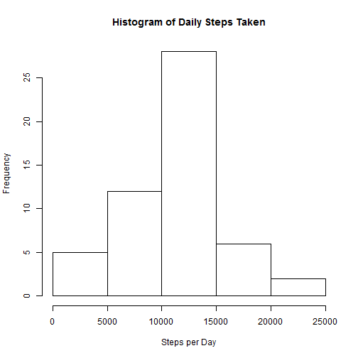
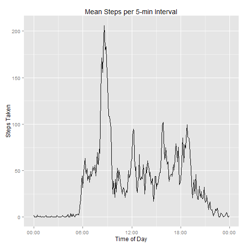
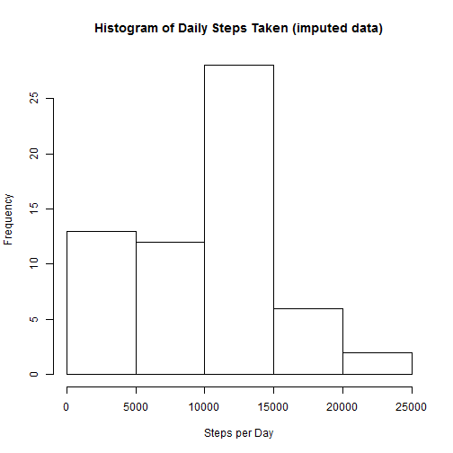
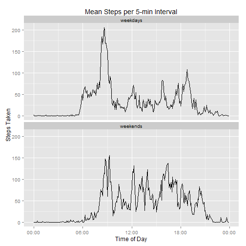

## Loading and preprocessing the data
First load the data, already unzipped and located in the current directory.

```r
data <- read.csv("activity.csv")
str(data)
```

```
## 'data.frame':	17568 obs. of  3 variables:
##  $ steps   : int  NA NA NA NA NA NA NA NA NA NA ...
##  $ date    : Factor w/ 61 levels "2012-10-01","2012-10-02",..: 1 1 1 1 1 1 1 1 1 1 ...
##  $ interval: int  0 5 10 15 20 25 30 35 40 45 ...
```

Next open the libraries we will use for this project:
* `lubridate` for date & time manipulation
* `stringi` for string manipulation
* `ggplot2` for figures
* `scales` for time scaling on figures
* `dplyr` for dataframe manipulation
* `reshape2` for converting dataframe to long form


```r
library(lubridate)
library(stringi)
library(ggplot2)
library(scales)
library(dplyr)
library(reshape2)
```

Convert intervals to a new column of POSIXct time objects by padding out to 4 digits then parsing.  A dummy date is assigned to the objects.


```r
data$time <- parse_date_time(stri_pad_left(data$interval, 4, "0"), "HM")
head(data)
```

```
##   steps       date interval                time
## 1    NA 2012-10-01        0 0000-01-01 00:00:00
## 2    NA 2012-10-01        5 0000-01-01 00:05:00
## 3    NA 2012-10-01       10 0000-01-01 00:10:00
## 4    NA 2012-10-01       15 0000-01-01 00:15:00
## 5    NA 2012-10-01       20 0000-01-01 00:20:00
## 6    NA 2012-10-01       25 0000-01-01 00:25:00
```

Create a clean dataset without missing values.


```r
cleanData <- data[complete.cases(data$steps),]
```

## What is mean total number of steps taken per day?
Sum the steps taken on each day. 


```r
sumSteps <- aggregate(cleanData$steps, list(cleanData$date), FUN = sum)
colnames(sumSteps) <- c("date", "steps")
head(sumSteps)
```

```
##         date steps
## 1 2012-10-02   126
## 2 2012-10-03 11352
## 3 2012-10-04 12116
## 4 2012-10-05 13294
## 5 2012-10-06 15420
## 6 2012-10-07 11015
```

Make a histogram of the total number of steps taken each day.


```r
hist(sumSteps$steps, main = "Histogram of Daily Steps Taken", xlab = 
         "Steps per Day")
```

 

Calculate and report the mean and median of the total number of steps taken per day.


```r
cat(c("Mean steps taken daily:", round(mean(sumSteps$steps),2)))
```

```
## Mean steps taken daily: 10766.19
```

```r
cat(c("Median steps taken daily:", median(sumSteps$steps)))
```

```
## Median steps taken daily: 10765
```


## What is the average daily activity pattern?
Average the steps taken in each 5-minute interval over all days into a new dataframe.


```r
intervalAvg <- aggregate(cleanData$steps, list(cleanData$time), FUN = mean)
colnames(intervalAvg) <- c("time", "steps")
head(intervalAvg)
```

```
##                  time     steps
## 1 0000-01-01 00:00:00 1.7169811
## 2 0000-01-01 00:05:00 0.3396226
## 3 0000-01-01 00:10:00 0.1320755
## 4 0000-01-01 00:15:00 0.1509434
## 5 0000-01-01 00:20:00 0.0754717
## 6 0000-01-01 00:25:00 2.0943396
```

Make a time series line plot of the 5-minute interval (x-axis) and the average number of steps taken, averaged across all days (y-axis)


```r
p1 <- ggplot(intervalAvg, aes(x = time, y = steps)) +
    geom_line() +
    scale_x_datetime(labels = date_format("%H:%M")) +
    xlab("Time of Day") + ylab("Steps Taken") +
    ggtitle("Mean Steps per 5-min Interval")

p1
```

 

Which 5-minute interval, on average across all the days in the dataset, contains the maximum number of steps?


```r
maxTime <- intervalAvg$time[which.max(intervalAvg$steps)]
cat(c("The interval with the maximum average number of steps begins at", 
      format(maxTime, "%H:%M.")))
```

```
## The interval with the maximum average number of steps begins at 08:35.
```

## Imputing missing values

Calculate and report number of missing data points.


```r
missing <- sum(!complete.cases(data))
cat(c(missing, "data points are missing values."))
```

```
## 2304 data points are missing values.
```

To fill in missing data, use the median value of steps taken during that particular 5-minute interval.  First create a lookup table of interval median values from cleaned dataset.


```r
intervalMed <- aggregate(cleanData$steps, list(cleanData$time), FUN = median)
colnames(intervalMed) <- c("time", "steps")
head(intervalMed)
```

```
##                  time steps
## 1 0000-01-01 00:00:00     0
## 2 0000-01-01 00:05:00     0
## 3 0000-01-01 00:10:00     0
## 4 0000-01-01 00:15:00     0
## 5 0000-01-01 00:20:00     0
## 6 0000-01-01 00:25:00     0
```

Then create a new dataset and loop through to replace NAs with median values from lookup table


```r
imputedData <- data

for(i in 1:nrow(imputedData)) {
    if(is.na(imputedData$steps[i])) {
        lookupRow <- which(imputedData$time[i] == intervalMed$time, 
                           arr.ind = TRUE)
        imputedData$steps[i] <- intervalMed$steps[lookupRow]
    }
}

head(imputedData)
```

```
##   steps       date interval                time
## 1     0 2012-10-01        0 0000-01-01 00:00:00
## 2     0 2012-10-01        5 0000-01-01 00:05:00
## 3     0 2012-10-01       10 0000-01-01 00:10:00
## 4     0 2012-10-01       15 0000-01-01 00:15:00
## 5     0 2012-10-01       20 0000-01-01 00:20:00
## 6     0 2012-10-01       25 0000-01-01 00:25:00
```

Make a histogram of steps taken daily using the imputed data.


```r
impSumSteps <- aggregate(imputedData$steps, list(imputedData$date), FUN = sum)
colnames(impSumSteps) <- c("date", "steps")

hist(impSumSteps$steps, main = "Histogram of Daily Steps Taken (imputed data)", 
     xlab = "Steps per Day")
```

 

Calculate and report the mean and median of the total number of steps taken per day with the imputed data.


```r
cat(c("Mean steps taken daily:", round(mean(impSumSteps$steps),2)))
```

```
## Mean steps taken daily: 9503.87
```

```r
cat(c("Median steps taken daily:", median(impSumSteps$steps)))
```

```
## Median steps taken daily: 10395
```

Using data imputed with median interval values increases the number of days with fewer than 5000 steps taken, and predictably lowers the mean and median of daily steps taken.

## Are there differences in activity patterns between weekdays and weekends?

First create 2 new factor variables in the imputed dataframe, consisting of a day-of-week label and a logical whether or not the day is a weekday (i.e. Monday-Friday). 


```r
imputedData$DOW <- wday(imputedData$date, label = TRUE)
imputedData$weekday <- wday(imputedData$date) %in% 2:6
imputedData[c(1, 289, (288*5)+1),]
```

```
##      steps       date interval       time  DOW weekday
## 1        0 2012-10-01        0 0000-01-01  Mon    TRUE
## 289      0 2012-10-02        0 0000-01-01 Tues    TRUE
## 1441     0 2012-10-06        0 0000-01-01  Sat   FALSE
```

Create a new dataframe with averages by weekday or weekend.  (Not the most elegant solution---I couldn't figure out how to `summarise` two vectors in the same table using different `filter` criteria.)


```r
wkdayAvg <- imputedData %>%
    filter(weekday==TRUE) %>%
    group_by(time) %>%
    summarise(weekdays = mean(steps))

wkendAvg <- imputedData %>%
    filter(weekday==FALSE) %>%
    group_by(time) %>%
    summarise(weekends = mean(steps))

wkdayAvg$weekends <- wkendAvg$weekends
str(wkdayAvg)
```

```
## Classes 'tbl_df', 'tbl' and 'data.frame':	288 obs. of  3 variables:
##  $ time    : POSIXct, format: "0000-01-01 00:00:00" "0000-01-01 00:05:00" ...
##  $ weekdays: num  2.0222 0.4 0.1556 0.1778 0.0889 ...
##  $ weekends: num  0 0 0 0 0 3.25 0 0 0 0.375 ...
##  - attr(*, "drop")= logi TRUE
```

Melt the data into long form then create vertically stacked line plots to compare weekday and weekend interval averages. 


```r
longData <- melt(wkdayAvg, id.vars='time', variable.name='type', 
                 value.name='steps')

p2 <- ggplot(longData, aes(x = time, y = steps)) +
    geom_line() +
    scale_x_datetime(labels = date_format("%H:%M")) +
    ggtitle("Mean Steps per 5-min Interval") +
    xlab("Time of Day") + ylab("Steps Taken") +
    facet_wrap(~ type, ncol = 1)
p2
```

 

Some observations:
* activity begins earlier on weekdays, with the greatest number of steps occurring during what may be a morning commute between 08:00 and 09:00
* activity levels on weekends appear somewhat higher during the day on weekends, and continue later in the evening until about 21:00.
